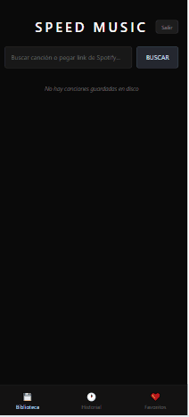

# 🎵 Speed Music: Real-Time Song Speed Control & Playback

Speed Music is a modern platform designed to let you change the playback speed of your songs in real time, while you listen—no need for separate programs or complicated tools. Download, play, and control your music speed instantly, all in one seamless experience for both mobile and desktop devices.

   

---

## 🌟 The Problem & The Solution

Most music apps force you to use separate software just to change playback speed, making practice, study, or enjoyment less convenient. Speed Music solves this by letting you adjust song speed on the fly, as you listen—no exporting, no switching apps, no hassle. Download your favorite tracks, play them, and control the tempo instantly, all in one place.

### 🚀 Core Features

- **Real-Time Speed Control:** Instantly change the playback speed of any song while listening—perfect for musicians, language learners, or anyone who wants more control.
- **Fast Song Downloads:** Search and download music directly from the app, no extra steps required.
- **Integrated Player:** Enjoy your tracks with a modern player and advanced controls, including speed adjustment.
- **Favorites & History Management:** Save your favorite tracks and easily access your download history.
- **Spotify Sync:** Import playlists or search for songs using the Spotify API.
- **Offline Support:** Access your downloaded music even without an internet connection.
- **Google/Firebase Authentication:** Secure, cross-platform access.

---

## 📱 User Experience & Mobile-First Strategy

- **User-Friendly UI:** Interface optimized for one-handed use and quick navigation.
- **Real-Time Feedback:** Instantly hear speed changes as you adjust the slider—no lag, no reloads.
- **Optimal Performance:** Instant loading and smooth playback, even on low-end devices.
- **PWA Ready:** Install the app on your phone or PC like a native application.

---

## 🛠️ Tech Stack

- **Frontend:** React Native + TypeScript (Expo)
- **Backend:** Node.js + TypeScript (Express) ([music-backend](../music-backend))
- **Database & Auth:** Firebase (Firestore, Authentication)
- **Integrations:** Spotify API
- **Visualizations:** Recharts for usage and download stats
- **Styling:** Tailwind CSS (mobile-first)

---

## 📂 Backend Folder: `music-backend`

This folder contains the backend API for Speed Music. It is built with Node.js, Express, and TypeScript. Its main responsibilities are:

- Handling music download requests
- Managing communication with the Spotify API
- Serving audio files to the frontend
- Providing endpoints for user actions (downloads, favorites, etc.)

**Main dependencies:**

- express
- axios
- cors
- dotenv
- typescript

**Dev scripts:**

- `npm run dev` — Start backend in development mode
- `npm run build` — Compile TypeScript
- `npm start` — Run compiled server

---

## ⚙️ Installation & Setup

1. **Clone the repository:**  
   `git clone https://github.com/youruser/speed-music.git`
2. **Install dependencies:**  
   `npm install` in both `music-backend` and `speed-music-app` directories
3. **Environment variables:**  
   Create a `.env` file with your Firebase config and required API keys.
4. **Run in development mode:**  
   - Backend: `npm run dev` in `music-backend`
   - App: `npm start` in `speed-music-app`

---

## ✨ Developed by Juan Zamudio – Unlimited music, instantly.
